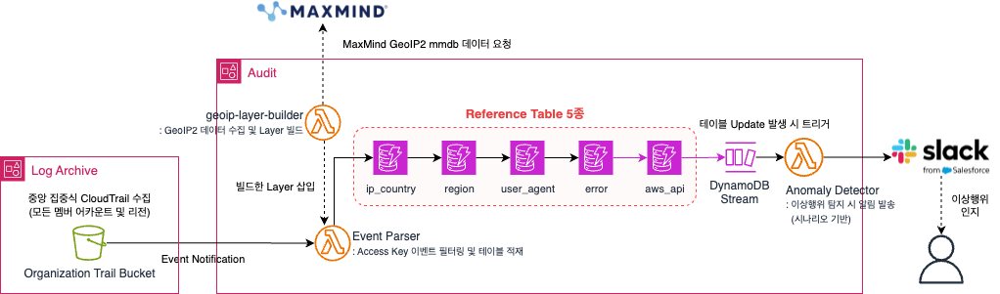

# AWS Access Key Anomaly Detection

> IAM Access Key 유출 및 이상행위를 실시간으로 탐지하여 신속한 대응을 지원하는 보안 모니터링 시스템

최종 수정일: 2026-08-19

 

## 개요

AWS CloudTrail 이벤트를 기반으로 IAM Access Key(AKIA)의 이상행위를 실시간으로 탐지하고, Slack으로 알림을 발송하는 보안 모니터링 시스템입니다.

CloudTrail 이벤트를 5개의 Reference Table로 분리 적재하여 다차원 컨텍스트를 수집하고, DynamoDB Streams를 통해 데이터 적재 즉시 탐지 로직을 실행합니다. 공격자 행위 패턴을 기반으로 설계된 5개의 탐지 시나리오를 통해 이상행위를 식별합니다.

**활용 서비스**
- **AWS**: CloudTrail, DynamoDB (+ Streams), Lambda, Secrets Manager, S3
- **외부**: MaxMind GeoLite2-City (IP 지리 정보 조회), Slack API (알림)

**활용 기술**
- **Python**: boto3, geoip2, requests

> 아키텍처, Reference Table 스키마 등 자세한 구성은 [인프라스트럭처 문서](./INFRASTRUCTURE.md)를 참고하세요.

 

아래 5가지 시나리오를 기준으로 이상행위를 탐지합니다.

## 탐지 시나리오

| 시나리오 | 제목 | 트리거 | 조건 |
|---------|------|--------|------|
| 시나리오 1 | 공격자 초기 정찰 의심 | GetCallerIdentity / ListUserPolicies / ListAttachedUserPolicies | 국외 IP에서 호출 |
| 시나리오 2 | 권한 상승 시도 의심 | CreateAccessKey / AttachUserPolicy / CreateUser 등 | 국외 IP에서 호출 |
| 시나리오 3 | 짧은 시간 내 다수 AccessDenied | ref_error_event INSERT | 5분 내 동일 키 N회 이상 AccessDenied |
| 시나리오 4 | 비정상 리전 리소스 생성 의심 | RunInstances / CreateFunction | 허용 리전 외에서 호출 |
| 시나리오 5 | 알려진 공격 도구 사용 의심 | 모든 API 호출 | UserAgent에 공격 도구 시그니처 포함 |

 

## 문서

- [인프라스트럭처](./INFRASTRUCTURE.md) — 아키텍처, Reference Table 스키마 등 상세 구성
- [셋업 가이드](./SETUP.md) — DynamoDB/Secrets Manager/환경변수 설정 및 배포 순서
- [체인지로그](./CHANGELOG.md) — 버전별 변경 이력

 

## 활용 사례

- 사내 Control Tower 환경에 직접 구축하여 운영 중
- 고객사 2곳 도입 검토 진행 중 (2026 현재)
